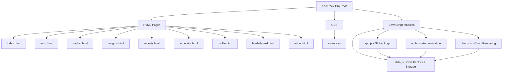

# 🌿 EcoTrack Pro – Smart Carbon Intelligence Platform

**EcoTrack Pro** is a next-generation, AI-inspired web platform that empowers individuals to **track, analyze, and reduce their carbon footprint** through real-time insights, predictive analytics, and interactive simulations.

Designed with a strong focus on **sustainability, usability, and data visualization**, the platform transforms complex environmental data into **simple, actionable decisions**.

---

## 🛑 Problem Statement

Climate change is accelerating due to rising carbon emissions, much of which stems from **daily individual activities** such as transportation, electricity usage, and food consumption.

However:

- Most individuals **lack awareness** of their personal carbon footprint
- Existing tools are **complex, non-interactive, or non-personalized**
- There is **no engaging system** to motivate consistent eco-friendly behavior

This creates a gap between **awareness and action**.

---

## 💡 Solution Overview

**EcoTrack Pro bridges this gap** by providing an intuitive, multi-page dashboard that:

- Tracks daily emissions across multiple categories
- Uses a **rule-based AI engine** to generate personalized insights
- Visualizes data through interactive charts
- Simulates real-life scenarios for better decision-making
- Motivates users using **gamification and achievements**

---

## 🧩 Project Architecture (File Structure Diagram)



## 🔄 Application Workflow

```mermaid
flowchart TD
    A([User Opens App]) --> B{Authenticated?}

    B -- No --> C[Login / Signup (auth.html)]
    B -- Yes --> D[Dashboard (index.html)]

    C --> D

    D --> E[Enter Daily Data (tracker.html)]
    E --> F[CO2 Calculation Engine]

    F --> G[(Store in LocalStorage)]
    G --> H[Update Charts & UI]

    H --> I[Generate Insights (insights.html)]
    H --> J[Update Gamification (Badges, Score)]
    H --> K[Scenario Simulation (simulator.html)]
    H --> L[Reports & Forecast (reports.html)]

    I --> M([User Improves Habits])
    K --> M
    L --> M

    M --> E
```

## 🏗️ System Architecture

EcoTrack Pro follows a **client-side modular architecture** using browser-based storage and processing.

### 🔹 Architecture Layers:

```mermaid
graph TD
    A[User Interface Layer] --> B[Application Logic Layer]
    B --> C[Data Processing Engine]
    C --> D[LocalStorage Database]

    B --> E[AI Insight Engine]
    B --> F[Visualization Engine]

    F --> G[Charts UI]
    E --> G
