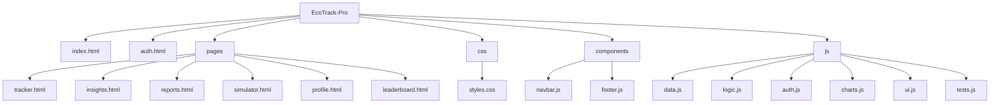
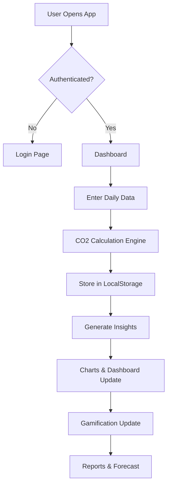
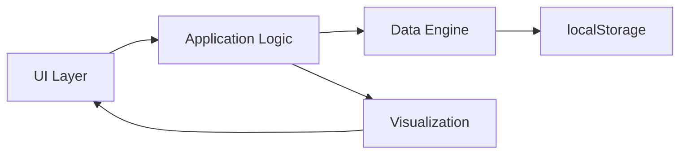
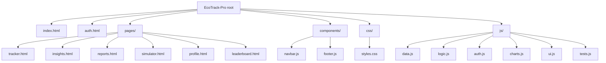

# EcoTrack Pro
AI-powered carbon footprint tracker with insights, forecasting & gamification

------------------------------------------------------------
🔥 EcoTrack Pro — Smart Carbon Intelligence (Hackathon Build)
------------------------------------------------------------

EcoTrack Pro is a privacy-first, client-side web application that helps individuals log daily transport, electricity and diet habits, converts those logs into per-category CO2e calculations, generates explainable AI-style insights, simulates lifestyle changes, and motivates progress with gamification and leaderboards.

Project Name
------------
- **EcoTrack Pro** — a compact, production-minded static prototype for personal carbon tracking and behavior change.

Problem Statement
-----------------
- Climate change is driven by many small daily actions. Individuals often lack simple, private, and actionable feedback about how their daily choices (commute, AC use, food) translate to carbon emissions.
- Without clear metrics, personalized recommendations, and motivating feedback, behavior change is difficult to start and sustain.

Overview / Purpose
------------------
- EcoTrack Pro provides a lightweight, offline-first dashboard to measure personal carbon impact, receive prioritized suggestions, simulate improvements, and track progress using a gamified score and badges.
- Purpose: empower users to understand and reduce their personal footprint with explainable suggestions and measurable outcomes.

Core Features
-------------
- 🧮 Carbon Tracking Engine — category-level CO2e calculation (transport, electricity, food).
- 🤖 AI Smart Insights — deterministic, rule-based recommendations tailored to recent logs.
- 🧭 Scenario Simulator — interactive sliders to preview potential savings and monthly impact.
- 📈 Reports & Forecasting — 7-day trend, deterministic 5-day forecast, and exportable summaries.
- 🏆 Gamification — Eco Score, streaks, points and achievement badges to reinforce behavior.
- 🏅 Leaderboard — simulated top users with the ability to include your demo profile.
- 📊 Charts & Visualization — Chart.js-powered line, doughnut, and bar charts with theme support.
- ♿ Accessibility & Security — aria labels, focus states, input sanitization, safe DOM handling.

Tech Stack
----------
- HTML5, CSS3 (responsive, glassmorphism-inspired visuals)
- Vanilla JavaScript (ES6 modules and components)
- Chart.js (visualization)
- localStorage (privacy-first simulated backend)
- No external backend required — fully client-side prototype

Architecture & Folder Structure
-------------------------------
The project follows a modular, component-driven structure that separates data, logic, UI, and components.

Folder structure (simplified)


Modular design explanation
- `data.js`: authoritative CO2 factors, sanitization, and calculation helpers (`calculateTransport`, `calculateElectricity`, `calculateDiet`, `calculateTotal`). Centralized to ensure consistency and testability.
- `logic.js`: application logic (insights, forecasts, gamification) that uses `data.js` for numerical calculations.
- `charts.js`: Chart.js adapter — exposes `renderLine`, `renderDoughnut`, `renderBars`, and includes safe destroy/update semantics.
- `auth.js` & `ui.js`: Authentication simulation, UI initialization, and helpers to keep page-specific code minimal.
- `components/`: small web components (navbar, footer) for consistent layout and improved accessibility.

System Workflow (step-by-step)
-----------------------------
1. User Input — User logs daily activities (transport mode, distance, electricity usage, diet).
2. CO2 Calculation Engine — `data.js` converts inputs to category emissions with clamping & sanitization.
3. Data Storage — entries are saved in `localStorage` using a safe wrapper.
4. AI Insight Generation — `logic.js` runs rule-based analysis on recent history to produce prioritized tips.
5. Visualization — updated charts and trend indicators reflect new data.
6. Gamification Update — Eco Score, streaks, points and badges get recalculated and persisted.

System Workflow (Mermaid flowchart)


Architecture diagram (component view)


How to run locally (developer)
------------------------------
1. Serve the repo from the project root (any static server). Example with Python:

```bash
python -m http.server 8000
```

2. Open in your browser and seed demo data with `?demo&dev`:

```
http://localhost:8000/?demo&dev
```

Testing
-------
- `js/tests.js` contains lightweight tests for CO2 calculation, scoring, and forecasting.
- Tests auto-run when served from `localhost` or when `?dev` is present.

Security, Accessibility & Quality
---------------------------------
- Input sanitization: all free-text inputs are sanitized before storage or rendering.
- Safe DOM patterns: removed `innerHTML` usage in favor of element creation to avoid injection.
- Error-tolerant storage: `localStorage` access wrapped in try/catch to avoid runtime crashes.
- Accessibility: skip link, aria labels, focus-visible states, and color contrast checks applied.

Purpose & Audience
------------------
- Purpose: provide a demonstrable, testable prototype that maps daily behavior to measurable environmental impact and supports behavior change.
- Audience: judges, recruiters, sustainability researchers, and early adopters looking for a privacy-respecting carbon tracking prototype.

Contributing
------------
- Fork the repo, create a branch, and open a PR. Focus areas: improved modeling, backend sync, more robust E2E tests, and UX polish.

Deployment & CI suggestions
--------------------------
- GitHub Pages: publish `main` branch as a static site for quick demo.
- CI: add a GitHub Actions workflow that serves the repo and runs a headless browser (Playwright) to call `window.EcoTests.runAllTests()` for PR gating.

Repository & Upload
-------------------
- Repository: https://github.com/Milind-277/EcoTrack-Pro.git
- Branch: `main` (recent changes pushed)

License
-------
- Add a LICENSE file to clarify reuse terms. For hackathon/demo, `MIT` is a common choice.

Questions or next steps
----------------------
- I can scaffold a GitHub Actions workflow to run the browser tests automatically on PRs, or help publish the site to GitHub Pages. Which should I do next?


Project analysis (current state)
--------------------------------
- Status: Hackathon-ready static prototype. Multi-page UX, Chart.js visualizations, and localStorage-backed user simulation.
- Quality: Tests included and passing in-browser. Accessibility and contrast audited and improved. Console errors resolved and Chart.js usage hardened.
- Security: Input sanitization added, removed unsafe `innerHTML` usage, and localStorage access wrapped with error handling.
- Priority work done: authentication simulation, centralized CO2 calculation helpers, chart rendering resilience, UI polish and responsive fixes.

What changed in this upload
---------------------------
- Hardening & security: `components/navbar.js`, `components/footer.js`, `js/auth.js`
- Centralized CO2 engine: `js/data.js` (added `calculateTransport`, `calculateElectricity`, `calculateDiet`, `calculateTotal`)
- Logic delegation: `js/logic.js` now uses `EcoData` helpers
- Chart resilience: `js/charts.js` (destroy guards and fallbacks)
- UI & accessibility polish: `css/styles.css`, `js/ui.js`
- Tests: `js/tests.js` present and auto-run in dev mode

Run locally (quick)
-------------------
1. Serve the folder from the project root (Python simple server):

```bash
python -m http.server 8000
```

2. Open the app in your browser:

```
http://localhost:8000/?demo&dev
```

- `?demo&dev` seeds a demo user and enables the in-browser dev test runner which prints PASS/FAIL to the console.

Tests
-----
- Client tests live in `js/tests.js`. They run automatically when the site is served from `localhost` or when `localStorage.ecoTrackDevMode=true`.
- I executed the test suite in a browser environment (served at `http://localhost:8000/?dev`) and all tests passed.

Upload / GitHub information
---------------------------
- Repository pushed to: https://github.com/Milind-277/EcoTrack-Pro.git
- Branch: `main`
- Commit message used for this upload: "Hardening, accessibility, centralized CO2 calculations, chart guards, UI polish"

Architecture & Folder Structure
-------------------------------


Workflow
--------
```mermaid
flowchart TD
	User-->|Open App|Auth[Auth Check]
	Auth-->|Not Authenticated|AuthPage[Sign In / Sign Up]
	Auth-->|Authenticated|Dashboard[Dashboard (index.html)]
	Dashboard-->Tracker[Log Daily Activity (tracker.html)]
	Tracker-->|Save|LocalStorage[localStorage]
	LocalStorage-->|Update|Logic[EcoLogic calculates emissions]
	Logic-->Charts[Update Charts via EcoCharts]
	Logic-->Insights[Generate rule-based insights]
	Dashboard-->Simulator[Simulator (pages/simulator.html)]
	Simulator-->Charts
```

Deployment & CI suggestions
--------------------------
- GitHub Pages: publish the `main` branch as a site (root) to serve the static app.
- CI: add a GitHub Actions workflow to run a headless browser (Playwright) that opens `http://localhost:8000/?dev` and runs `window.EcoTests.runAllTests()` to gate PRs.

Next recommended actions
------------------------
1. Add a lightweight CI workflow to run the in-browser tests on push/PR.
2. Configure GitHub Pages (or Netlify) for a live demo URL.
3. Optionally add Puppeteer/Playwright e2e tests and a release changelog.

Thank you — this README was updated as part of the recent upload to GitHub. If you want, I can also scaffold the GitHub Actions CI workflow to run the tests automatically.

