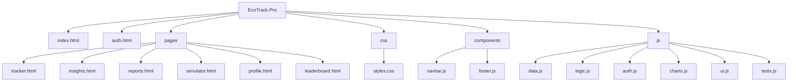
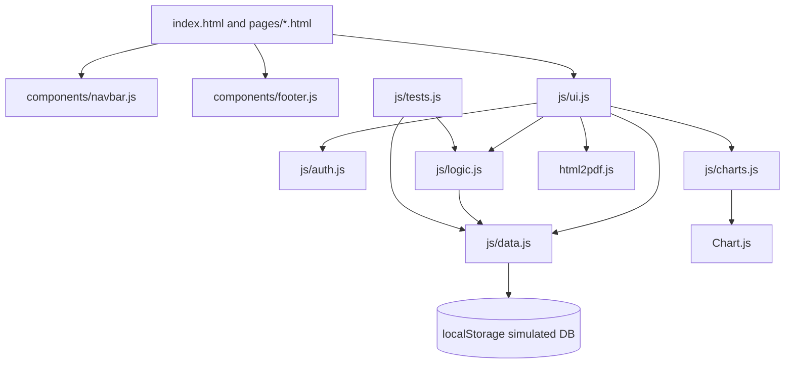
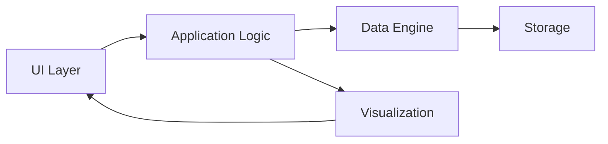
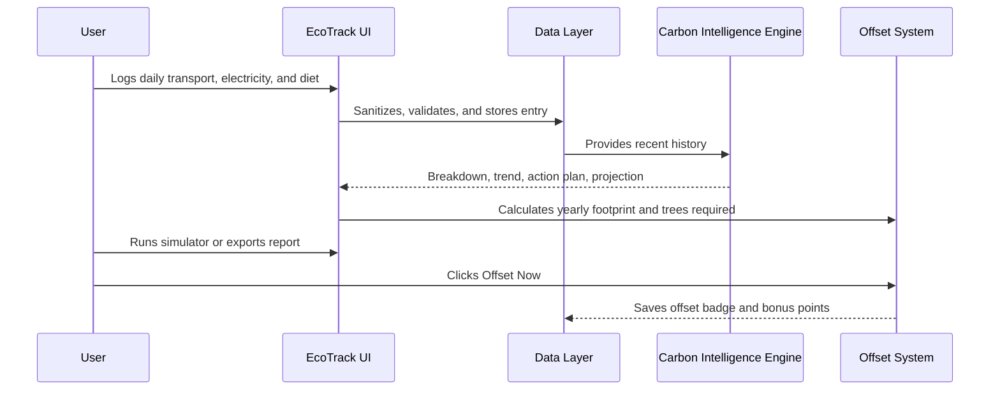

## EcoTrack Pro
AI-powered carbon footprint tracker with insights, forecasting, and gamification

---

Problem Statement
----------
- Climate change is driven by many small daily actions. Individuals often lack simple, private, and actionable feedback about how their daily choices (commute, AC use, food) translate to carbon emissions.
- Without clear metrics, personalized recommendations, and motivating feedback, behavior change is difficult to start and sustain.

---

Overview / Purpose
----------
- EcoTrack Pro provides a lightweight, offline-first dashboard to measure personal carbon impact, receive prioritized suggestions, simulate improvements, and track progress using a gamified score and badges.
- Purpose: empower users to understand and reduce their personal footprint with explainable suggestions and measurable outcomes.

---

Core Features
----------
- 🧮 Carbon Tracking Engine — category-level CO2e calculation (transport, electricity, food).
- 🤖 AI Smart Insights — deterministic, rule-based recommendations tailored to recent logs.
- 🧭 Scenario Simulator — interactive sliders to preview potential savings and monthly impact.
- 📈 Reports & Forecasting — 7-day trend, deterministic 5-day forecast, and exportable summaries.
- 🏆 Gamification — Eco Score, streaks, points and achievement badges to reinforce behavior.
- 🏅 Leaderboard — simulated top users with the ability to include your demo profile.
- 📊 Charts & Visualization — Chart.js-powered line, doughnut, and bar charts with theme support.
- ♿ Accessibility & Security — aria labels, focus states, input sanitization, safe DOM handling.

---

Tech Stack
----------
- HTML5, CSS3 (responsive, glassmorphism-inspired visuals)
- Vanilla JavaScript (ES6 modules and components)
- Chart.js (visualization)
- localStorage (privacy-first simulated backend)
- No external backend required — fully client-side prototype

---

Architecture & Folder Structure
-------------------------------
The project follows a modular, component-driven structure that separates data, logic, UI, and components.

Folder structure (simplified)


Modular design explanation
- `data.js`: authoritative CO2 factors, sanitization, and calculation helpers (`calculateTransport`, `calculateElectricity`, `calculateDiet`, `calculateTotal`). Centralized to ensure consistency and testability.
- `logic.js`: application logic (insights, forecasts, gamification) that uses `data.js` for numerical calculations.
- `charts.js`: Chart.js adapter — exposes `renderLine`, `renderDoughnut`, `renderBars`, and includes safe destroy/update semantics.
- `auth.js` & `ui.js`: Authentication simulation, UI initialization, and helpers to keep page-specific code minimal.
- `components/`: small web components (navbar, footer) for consistent layout and improved accessibility.

---

System Workflow (step-by-step)
-----------------------------
1. User Input — User logs daily activities (transport mode, distance, electricity usage, diet).
2. CO2 Calculation Engine — `data.js` converts inputs to category emissions with clamping & sanitization.
3. Data Storage — entries are saved in `localStorage` using a safe wrapper.
4. AI Insight Generation — `logic.js` runs rule-based analysis on recent history to produce prioritized tips.
5. Visualization — updated charts and trend indicators reflect new data.
6. Gamification Update — Eco Score, streaks, points and badges get recalculated and persisted.

---

Architecture
----------


---

Architecture diagram (component view)


---

User Workflow
----------


## Intelligence Engine

The intelligence engine in `js/logic.js` combines multiple signals:

- Travel, electricity, and diet contribution percentages.
- Weekly trend percentage and trend direction.
- Highest-impact category detection.
- Personalized action plan.
- Monthly reduction projection from travel reduction and electricity reduction assumptions.
- Yearly emissions, trees required, and simulated offset cost.

Example output:

```text
Travel contributes 58%, electricity 27%, and diet 15%.
Your emissions increased by 8% this week.
Reducing travel by 20% and electricity by 2 hrs/day can reduce about 90 kg/month.
```

## Testing

`js/tests.js` auto-runs on page load and prints PASS/FAIL output in the console.

Included test functions:

- `testCarbonCalculation()`
- `testScoreCalculation()`
- `testPredictionLogic()`
- `testInputValidation()`
- `testEdgeCases()`

Expected console output:

```text
✔ PASS testCarbonCalculation
✔ PASS testScoreCalculation
✔ PASS testPredictionLogic
✔ PASS testInputValidation
✔ PASS testEdgeCases
5/5 tests passed
```

## Security

- All user-facing text input goes through `sanitizeText()`.
- Numeric inputs are clamped to safe non-negative ranges.
- Invalid enum values are rejected and replaced with safe defaults.
- User-controlled data is rendered with `textContent` and DOM nodes, not unsafe HTML injection.
- localStorage access is wrapped in try/catch.
- Passwords use Web Crypto SHA-256 where available. This is still a static prototype, so localStorage is treated as a simulated database rather than production authentication.

## Accessibility

- Semantic `nav`, `main`, `section`, `article`, `table`, and `footer` structure.
- Skip link for keyboard users.
- Labels and `aria-label` values for form controls.
- Visible focus states.
- High-contrast dark and light themes.
- Mobile responsive layout with keyboard-accessible navigation.

## Real-World Impact

EcoTrack Pro turns abstract carbon numbers into a concrete improvement loop:

1. Measure daily habits.
2. Understand which category dominates emissions.
3. Follow a specific action plan.
4. Simulate the savings before changing behavior.
5. Forecast and report progress.
6. Offset residual yearly emissions.

## Future Scalability

- Replace localStorage with Firebase, Supabase, or PostgreSQL without changing UI contracts.
- Add organization dashboards for team or campus challenges.
- Integrate smart meter, UPI transaction, commute, and fitness APIs.
- Add verified carbon credit providers.
- Add anomaly detection and seasonal forecasting models.

## Live Demo

https://milind-277.github.io/EcoTrack-Pro/


