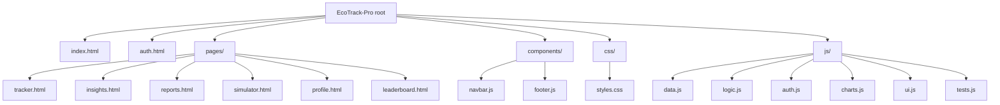

# EcoTrack Pro
AI-powered carbon footprint tracker with insights, forecasting & gamification

Overview
--------
EcoTrack Pro is a privacy-first, client-side static web app that helps users log daily transport, electricity and diet habits, then turns that local data into insights, deterministic forecasts, simulations, scores, badges and a small leaderboard.

Project analysis (current state)
--------------------------------
- Status: Hackathon-ready static prototype. Multi-page UX, Chart.js visualizations, and localStorage-backed user simulation.
- Quality: Tests included and passing in-browser. Accessibility and contrast audited and improved. Console errors resolved and Chart.js usage hardened.
- Security: Input sanitization added, removed unsafe `innerHTML` usage, and localStorage access wrapped with error handling.
- Priority work done: authentication simulation, centralized CO2 calculation helpers, chart rendering resilience, UI polish and responsive fixes.

What changed in this upload
---------------------------
- Hardening & security: `components/navbar.js`, `components/footer.js`, `js/auth.js`
- Centralized CO2 engine: `js/data.js` (added `calculateTransport`, `calculateElectricity`, `calculateDiet`, `calculateTotal`)
- Logic delegation: `js/logic.js` now uses `EcoData` helpers
- Chart resilience: `js/charts.js` (destroy guards and fallbacks)
- UI & accessibility polish: `css/styles.css`, `js/ui.js`
- Tests: `js/tests.js` present and auto-run in dev mode

Run locally (quick)
-------------------
1. Serve the folder from the project root (Python simple server):

```bash
python -m http.server 8000
```

2. Open the app in your browser:

```
http://localhost:8000/?demo&dev
```

- `?demo&dev` seeds a demo user and enables the in-browser dev test runner which prints PASS/FAIL to the console.

Tests
-----
- Client tests live in `js/tests.js`. They run automatically when the site is served from `localhost` or when `localStorage.ecoTrackDevMode=true`.
- I executed the test suite in a browser environment (served at `http://localhost:8000/?dev`) and all tests passed.

Upload / GitHub information
---------------------------
- Repository pushed to: https://github.com/Milind-277/EcoTrack-Pro.git
- Branch: `main`
- Commit message used for this upload: "Hardening, accessibility, centralized CO2 calculations, chart guards, UI polish"

Architecture & Folder Structure
-------------------------------


Workflow
--------
```mermaid
flowchart TD
	User-->|Open App|Auth[Auth Check]
	Auth-->|Not Authenticated|AuthPage[Sign In / Sign Up]
	Auth-->|Authenticated|Dashboard[Dashboard (index.html)]
	Dashboard-->Tracker[Log Daily Activity (tracker.html)]
	Tracker-->|Save|LocalStorage[localStorage]
	LocalStorage-->|Update|Logic[EcoLogic calculates emissions]
	Logic-->Charts[Update Charts via EcoCharts]
	Logic-->Insights[Generate rule-based insights]
	Dashboard-->Simulator[Simulator (pages/simulator.html)]
	Simulator-->Charts
```

Deployment & CI suggestions
--------------------------
- GitHub Pages: publish the `main` branch as a site (root) to serve the static app.
- CI: add a GitHub Actions workflow to run a headless browser (Playwright) that opens `http://localhost:8000/?dev` and runs `window.EcoTests.runAllTests()` to gate PRs.

Next recommended actions
------------------------
1. Add a lightweight CI workflow to run the in-browser tests on push/PR.
2. Configure GitHub Pages (or Netlify) for a live demo URL.
3. Optionally add Puppeteer/Playwright e2e tests and a release changelog.

Thank you — this README was updated as part of the recent upload to GitHub. If you want, I can also scaffold the GitHub Actions CI workflow to run the tests automatically.

