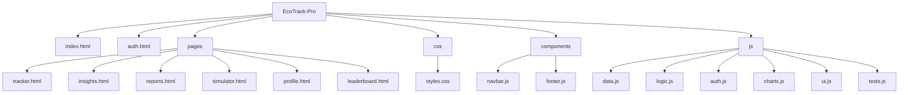
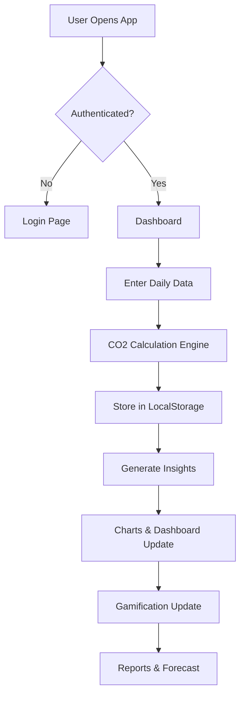
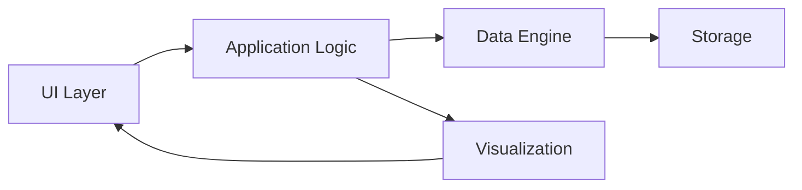

## EcoTrack Pro
AI-powered carbon footprint tracker with insights, forecasting & gamification

---

#Problem Statement
----------
- Climate change is driven by many small daily actions. Individuals often lack simple, private, and actionable feedback about how their daily choices (commute, AC use, food) translate to carbon emissions.
- Without clear metrics, personalized recommendations, and motivating feedback, behavior change is difficult to start and sustain.

--- 

Overview / Purpose
----------
- EcoTrack Pro provides a lightweight, offline-first dashboard to measure personal carbon impact, receive prioritized suggestions, simulate improvements, and track progress using a gamified score and badges.
- Purpose: empower users to understand and reduce their personal footprint with explainable suggestions and measurable outcomes.

---

Core Features
----------
- 🧮 Carbon Tracking Engine — category-level CO2e calculation (transport, electricity, food).
- 🤖 AI Smart Insights — deterministic, rule-based recommendations tailored to recent logs.
- 🧭 Scenario Simulator — interactive sliders to preview potential savings and monthly impact.
- 📈 Reports & Forecasting — 7-day trend, deterministic 5-day forecast, and exportable summaries.
- 🏆 Gamification — Eco Score, streaks, points and achievement badges to reinforce behavior.
- 🏅 Leaderboard — simulated top users with the ability to include your demo profile.
- 📊 Charts & Visualization — Chart.js-powered line, doughnut, and bar charts with theme support.
- ♿ Accessibility & Security — aria labels, focus states, input sanitization, safe DOM handling.

---

Tech Stack
----------
- HTML5, CSS3 (responsive, glassmorphism-inspired visuals)
- Vanilla JavaScript (ES6 modules and components)
- Chart.js (visualization)
- localStorage (privacy-first simulated backend)
- No external backend required — fully client-side prototype

---

Architecture & Folder Structure
-------------------------------
The project follows a modular, component-driven structure that separates data, logic, UI, and components.

Folder structure (simplified)

Modular design explanation
- `data.js`: authoritative CO2 factors, sanitization, and calculation helpers (`calculateTransport`, `calculateElectricity`, `calculateDiet`, `calculateTotal`). Centralized to ensure consistency and testability.
- `logic.js`: application logic (insights, forecasts, gamification) that uses `data.js` for numerical calculations.
- `charts.js`: Chart.js adapter — exposes `renderLine`, `renderDoughnut`, `renderBars`, and includes safe destroy/update semantics.
- `auth.js` & `ui.js`: Authentication simulation, UI initialization, and helpers to keep page-specific code minimal.
- `components/`: small web components (navbar, footer) for consistent layout and improved accessibility.

---

System Workflow (step-by-step)
-----------------------------
1. User Input — User logs daily activities (transport mode, distance, electricity usage, diet).
2. CO2 Calculation Engine — `data.js` converts inputs to category emissions with clamping & sanitization.
3. Data Storage — entries are saved in `localStorage` using a safe wrapper.
4. AI Insight Generation — `logic.js` runs rule-based analysis on recent history to produce prioritized tips.
5. Visualization — updated charts and trend indicators reflect new data.
6. Gamification Update — Eco Score, streaks, points and badges get recalculated and persisted.

System Workflow (Mermaid flowchart)

---

Architecture diagram (component view)

---

Live Demo 

https://milind-277.github.io/EcoTrack-Pro/
